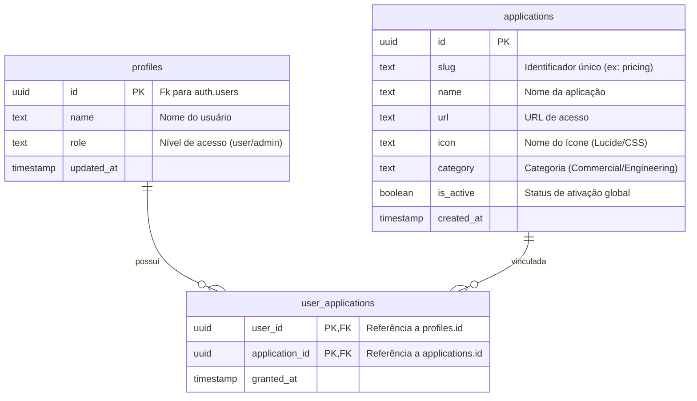

# Arquitetura do Ecossistema Allan Workbench

O **Allan Workbench** é um ecossistema descentralizado de ferramentas utilitárias independentes para o setor de energia. Este documento define as diretrizes de arquitetura, integração, segurança e desenvolvimento que regem todas as ferramentas e o portal principal.

---

## 1. Princípios Arquiteturais

1.  **Baixo Acoplamento e Isolamento Estrito**: Cada ferramenta é uma aplicação web autônoma em seu próprio repositório Git. Nenhuma ferramenta depende do código de outra.
2.  **Portal Launcher Decoplado**: O Portal funciona estritamente como um Launcher dinâmico. Ele não possui referências estáticas de nenhuma ferramenta ou regra de negócio específica do setor.
3.  **Registro Dinâmico (Application Registry)**: O ecossistema é governado por um catálogo centralizado no Supabase. O portal e as permissões de acesso são construídos em tempo de execução consultando este registro.
4.  **Stack Tecnológica Minimalista**:
    *   **Frontend**: HTML5 puro, CSS3 (Vanilla) e JavaScript nativo (ES6+).
    *   **Backend & DB**: Supabase (Auth, PostgreSQL, Storage e RLS).
    *   **Hospedagem**: GitHub Pages (um site por repositório/ferramenta).
5.  **Foco em Desenvolvimento Assistido por IA**: O isolamento absoluto reduz drasticamente o tamanho do contexto do projeto. Um agente de IA que trabalha na ferramenta A não precisa ler nem entender a ferramenta B, reduzindo o consumo de tokens e a chance de alucinações.
6.  **Identidade Visual Unificada**: Compartilhamento estrito do sistema de Design Tokens estabelecido no [DESIGN.md](./DESIGN.md).
7. Um agente deve conseguir desenvolver uma ferramenta inteira sem precisar abrir nenhum outro repositório do ecossistema.
8. Toda duplicação entre ferramentas é permitida para preservar isolamento de contexto. A redução do contexto dos agentes tem prioridade sobre a eliminação de código duplicado.

---

## 2. Estratégia de Autenticação Compartilhada (SSO Nativo)

O Portal centraliza a autenticação de usuários via Supabase Auth. Como as ferramentas compartilham domínios ou subdomínios vinculados ao mesmo projeto do Supabase, **não há necessidade de transportar tokens de acesso na URL**. A sessão é compartilhada de forma nativa e segura através do navegador.

### Mecanismo de Compartilhamento de Sessão

*   **Cenário A: Mesma Origem (Hospedagem padrão no GitHub Pages)**
    *   Caso o Portal e as ferramentas compartilhem a mesma *Origin* (ex: `allan.github.io/portal` e `allan.github.io/nacionalizacao`), o navegador compartilha o `localStorage` nativamente. O Supabase client de qualquer ferramenta lê o token armazenado em `sb-<project-id>-auth-token` automaticamente.
*   **Cenário B: Subdomínios Customizados (ex: `*.allanworkbench.com`)**
    *   Caso cada ferramenta e o portal usem subdomínios diferentes (ex: `portal.allanworkbench.com` e `pricing.allanworkbench.com`), o cookie de autenticação do Supabase é configurado para usar o domínio base curinga: `.allanworkbench.com`. O cookie de sessão do usuário é compartilhado nativamente pelo navegador em todas as requisições para estes subdomínios.

### Fluxo de Inicialização de Sessão na Ferramenta

Toda ferramenta, ao ser carregada, deve verificar a sessão de forma assíncrona usando o SDK do Supabase. Não há parsing manual de URLs.

```javascript
// supabase.js - Inicialização e Handshake de Sessão Nativo
const supabaseUrl = CONFIG.SUPABASE_URL;
const supabaseKey = CONFIG.SUPABASE_ANON_KEY;
const supabase = supabase.createClient(supabaseUrl, supabaseKey, {
  auth: {
    persistSession: true,
    storageKey: `sb-${CONFIG.SUPABASE_PROJECT_ID}-auth-token`,
    // Para subdomínios, configurar cookieOptions.domain se necessário
  }
});

async function checkAuthAndInit() {
  try {
    // Busca a sessão ativa armazenada no navegador (localStorage/cookie)
    const { data: { session }, error } = await supabase.auth.getSession();
    
    if (error) throw error;
    
    if (!session) {
      // Redireciona para o login se não estiver logado
      redirectToPortal();
      return null;
    }
    
    console.log("Usuário autenticado nativamente via SSO:", session.user.email);
    return session;
  } catch (err) {
    console.error("Falha ao recuperar sessão ativa:", err);
    redirectToPortal();
    return null;
  }
}

function redirectToPortal() {
  window.location.href = CONFIG.PORTAL_URL;
}
```

---

## 3. Modelo de Dados e Registry (Supabase)

O ecossistema é mapeado no Supabase PostgreSQL usando um modelo relacional normalizado e flexível. O Portal consulta essas tabelas para renderizar o Launcher dinamicamente.



### Consulta de Lançamento Dinâmico (Portal)
Para listar as ferramentas permitidas de um usuário logado, o Portal realiza a seguinte consulta. **Atenção**: sempre incluir o filtro explícito por `user_id` no client-side como defesa em profundidade (defense-in-depth), mesmo que o RLS já filtre no servidor. Se o RLS for desconfigurado acidentalmente, a aplicação não expõe dados de outros usuários.

```javascript
// Busca do catálogo dinâmico de aplicações do usuário
async function getUserApplications() {
  const session = await supabase.auth.getSession();
  const userId = session.data.session.user.id;

  const { data, error } = await supabaseClient
    .from('applications')
    .select('id, name, url, icon, category, user_applications!inner(user_id)')
    .eq('is_active', true)
    .eq('user_applications.user_id', userId);

  if (error) {
    console.error('Erro ao carregar aplicações:', error);
    return [];
  }
  return data;
}
```

O sufixo `!inner` na relação `user_applications` força um INNER JOIN — só retorna `applications` que tenham pelo menos uma linha correspondente em `user_applications`. Sem o `!inner`, seria LEFT JOIN (retornaria todas as aplicações, mesmo sem vínculo).

### Isolamento de Dados por Ferramenta
1.  **Prefixos nas Tabelas**: Cada ferramenta armazena seus dados em tabelas dedicadas prefixadas pelo seu slug curto.
    *   Exemplo (Nacionalização): `nac_items`, `nac_configurations`.
    *   Exemplo (Precificação): `prc_rules`, `prc_margins`.
2.  **Políticas de RLS (Row Level Security)**: Todas as tabelas devem possuir RLS ativada, verificando se o usuário possui entrada na tabela `user_applications` para a aplicação dona dos dados.

Exemplo de política RLS para a tabela `nac_items`:
```sql
ALTER TABLE public.nac_items ENABLE ROW LEVEL SECURITY;

CREATE POLICY "Acesso permitido apenas para usuários vinculados à ferramenta nacionalizacao" 
ON public.nac_items 
FOR ALL
USING (
  auth.uid() IS NOT NULL AND 
  EXISTS (
    SELECT 1 FROM public.user_applications ua
    JOIN public.applications app ON app.id = ua.application_id
    WHERE ua.user_id = auth.uid() 
      AND app.slug = 'nacionalizacao' 
      AND app.is_active = true
  )
);
```

### Padrão de Trigger: Bypass para SQL Editor

Triggers que restringem operações (ex: bloquear alteração de `role`) **devem** permitir bypass quando executados via SQL Editor (`service_role`). O SQL Editor não possui JWT, portanto `auth.uid()` retorna `NULL` — este é o marcador confiável para detectar contexto server-side:

```sql
CREATE OR REPLACE FUNCTION public.check_profile_update()
RETURNS TRIGGER
SECURITY DEFINER
SET search_path = ''
LANGUAGE plpgsql
AS $$
BEGIN
    -- SQL Editor (service_role) não tem JWT → auth.uid() IS NULL → bypass
    IF auth.uid() IS NULL THEN
        RETURN NEW;
    END IF;

    -- Restrições aplicam-se apenas a chamadas via anon_key (cliente)
    IF OLD.role IS DISTINCT FROM NEW.role THEN
        RAISE EXCEPTION 'Não é permitido alterar o próprio role';
    END IF;

    RETURN NEW;
END;
$$;
```

**Regra**: `auth.uid() IS NULL` = server-side (SQL Editor, trigger bootstrap, cron jobs). `auth.uid()` com valor = cliente autenticado via `anon_key`. **Nunca** use `auth.role() = 'service_role'` — no SQL Editor essa função retorna `NULL` porque não há JWT.

---

## 4. O Componente `AppBridge`

A consistência de navegação é mantida pelo script `workbench-bridge.js`. Carregado por todas as ferramentas, ele executa as seguintes tarefas no carregamento da página:
1.  **Verificação de Autenticação**: Roda `checkAuthAndInit()`.
2.  **Injeção Dinâmica do Header**: Injeta uma barra superior na página com:
    *   Logo linkando de volta ao Portal.
    *   Dropdown de Troca Rápida de Ferramenta (carrega a lista de ferramentas permitidas do usuário de forma assíncrona do Supabase).
    *   Identificação do usuário ativo.
    *   Botão "Sair" (chama `supabase.auth.signOut()`, limpa dados locais e envia para o Portal).

---

## 5. Ciclo de Vida para Criação de Novas Ferramentas

Para incluir uma nova ferramenta no ecossistema Allan Workbench, deve-se seguir rigorosamente este fluxo de trabalho:

```
[1. Criar Repositório Git]
            │
            ▼
[2. Copiar Template Base] ──► (index.html, styles.css, app.js, supabase.js, config.js)
            │
            ▼
[3. Criar Documentação] ────► (README.md, PRD.md, AGENTS.md, CHANGELOG.md)
            │
            ▼
[4. Registrar no Registry] ──► (Adicionar registro na tabela 'applications')
            │
            ▼
[5. Liberar Acessos] ──────► (Associar usuários na tabela 'user_applications')
            │
            ▼
[6. Deploy no GitHub Pages]
```

### Detalhamento das Etapas

1.  **Criar Novo Repositório Git**: Iniciar um repositório independente nomeado como `allan-workbench-<slug-da-ferramenta>`.
2.  **Copiar o Template Base**: Copiar a estrutura estática padrão contendo a inicialização do Supabase e o carregamento do `workbench-bridge.js`.
3.  **Criar Documentação Local**: Criar os quatro arquivos obrigatórios na pasta `docs/` e raiz da ferramenta:
    *   `README.md`: Instruções de inicialização local e dependências.
    *   `PRD.md`: Requisitos de negócio e mockups da ferramenta.
    *   `AGENTS.md`: Diretrizes e regras de tabelas para agentes de IA atuarem nela.
    *   `CHANGELOG.md`: Histórico de modificações.
4.  **Registrar no Registry (Supabase)**: Inserir a nova ferramenta na tabela `public.applications` (slug, nome, URL da hospedagem, ícone a ser usado no launcher e categoria correspondente).
5.  **Liberar Acessos**: Adicionar registros na tabela `public.user_applications` vinculando os IDs dos usuários de teste à nova aplicação para torná-la visível no Launcher.
6.  **Deploy**: Configurar GitHub Actions para deploy contínuo da branch `main` no GitHub Pages do repositório da ferramenta.
